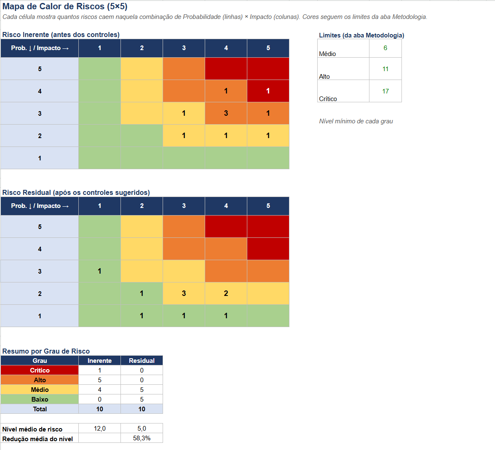

# Matriz de Riscos de Segurança da Informação (GRC)

Projeto de portfólio em **Governança, Riscos e Conformidade (GRC)**: uma matriz de riscos completa para uma clínica/hospital **fictícia**, com metodologia documentada, risco inerente e residual, mapa de calor e rastreabilidade com os controles da **ISO/IEC 27001:2022**.

> Todos os dados são fictícios e foram criados para fins de estudo. Nenhuma informação refere-se a uma organização real.

## Visão geral

| Item | Descrição |
| :--- | :--- |
| Cenário | Clínica/hospital fictício que trata dados pessoais sensíveis de saúde (LGPD) |
| Riscos avaliados | 10 riscos, de privacidade, continuidade, identidade, vulnerabilidades, terceiros, endpoint e outros |
| Método | Nível de risco = Probabilidade (1-5) × Impacto (1-5) |
| Arquivo | [`matriz_riscos_grc.xlsx`](matriz_riscos_grc.xlsx) |

## O que tem na planilha

### Aba `Matriz de Riscos`
- Descrição, categoria, responsável e **controle sugerido** para cada risco.
- **Risco inerente** (antes dos controles): probabilidade, impacto, nível e grau.
- **Tratamento:** mitigar, aceitar, transferir ou evitar.
- **Referência ao Anexo A da ISO/IEC 27001:2022** para cada risco.
- **Status do controle:** planejado, em andamento ou implementado.
- **Risco residual** (estimativa após os controles): probabilidade, impacto, nível e grau.
- Nível e grau são **fórmulas**: ao mudar uma nota, tudo se recalcula. Cores automáticas por grau, validação de dados (1 a 5) e filtros.

### Aba `Mapa de Calor`
- Dois mapas 5×5 (inerente e residual) que contam quantos riscos caem em cada combinação de probabilidade e impacto.
- Resumo por grau de risco e redução média do nível.

### Aba `Metodologia`
- Escalas de probabilidade e impacto, com descrição de cada nível.
- Limites de classificação **editáveis**: Baixo (1-5), Médio (6-10), Alto (11-16) e Crítico (17-25).
- Opções de tratamento e legenda das premissas.

## Resultado da avaliação

| Grau | Inerente | Residual |
| :--- | :---: | :---: |
| Crítico | 1 | 0 |
| Alto | 5 | 0 |
| Médio | 4 | 5 |
| Baixo | 0 | 5 |

O nível médio de risco cai de **12,0** para **5,0** (redução de cerca de **58%**) com a implementação dos controles sugeridos.

O risco de maior prioridade é o **R-03 (ransomware via phishing)**, com nível 20 (Crítico), seguido de R-04 (credenciais fracas, nível 16) e R-01 (acesso indevido a prontuário, nível 15).

## Riscos avaliados

| ID | Risco | Categoria |
| :--- | :--- | :--- |
| R-01 | Acesso indevido a prontuário eletrônico | Privacidade / Confidencialidade |
| R-02 | Falha ou corrupção de backup crítico | Continuidade de Negócios |
| R-03 | Ransomware via phishing | Segurança Operacional |
| R-04 | Credenciais fracas ou reutilizadas | Identidade e Acesso |
| R-05 | Servidor web com vulnerabilidades sem patch | Gestão de Vulnerabilidades |
| R-06 | Vazamento de segredos em repositório público | Desenvolvimento Seguro |
| R-07 | Indisponibilidade por ataque DDoS | Disponibilidade |
| R-08 | Descarte inadequado de equipamentos e mídias | Segurança Física |
| R-09 | Não conformidade de fornecedor de TI | Risco de Terceiros |
| R-10 | Perda de dispositivo sem criptografia | Segurança de Endpoint |

## Como usar
1. Baixe `matriz_riscos_grc.xlsx` e abra no Excel ou no LibreOffice.
2. Células com **texto azul** são entradas editáveis (probabilidade, impacto, tratamento, status e valores residuais). Texto preto são fórmulas.
3. Para alterar os critérios, edite os níveis mínimos na aba `Metodologia`. Grau, mapa de calor e resumo se atualizam sozinhos.

## Premissas e limitações
- As notas de probabilidade e impacto, os valores residuais, os status e as referências do Anexo A são **estimativas de estudo**, não uma avaliação real.
- A avaliação segue conceitos da **ISO/IEC 27005**, mas não substitui uma análise de riscos formal da organização.
- Em um cenário real, as notas devem ser definidas em conjunto com os donos dos processos e baseadas em evidências (incidentes, auditorias, ativos críticos).

## Projetos relacionados
- [Política de Segurança da Informação e Gestão de Credenciais](https://github.com/thlozz/psi-clinica-viver-bem): cada seção da política está ligada a um risco desta matriz.
- [Analisador de Logs de Segurança](https://github.com/thlozz/log-analyzer-soc): script que apoia a detecção de ataques de força bruta (risco R-04).

## Referências
- ISO/IEC 27001:2022, Anexo A (controles de segurança da informação)
- ISO/IEC 27005 (gestão de riscos de segurança da informação)
- Lei Geral de Proteção de Dados (Lei nº 13.709/2018)
